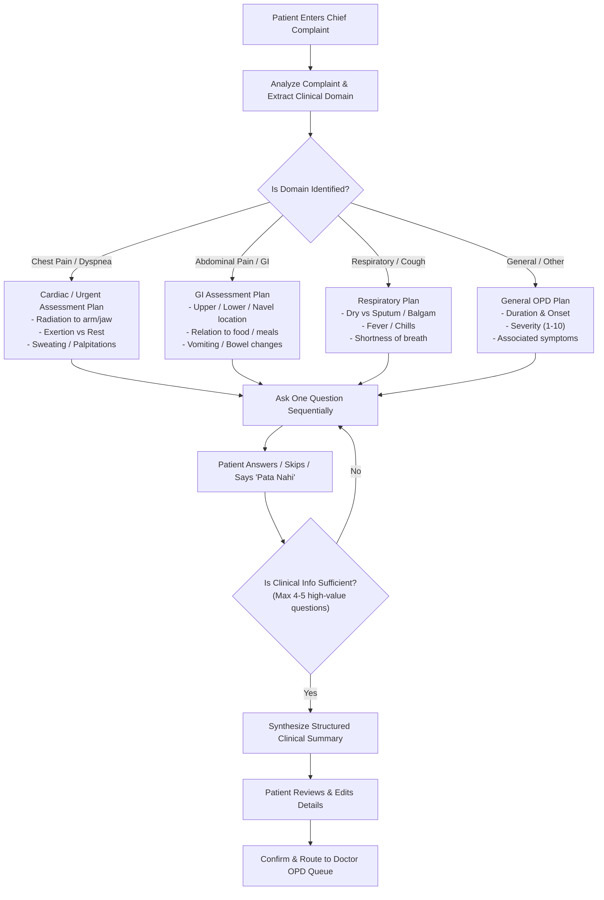

# Clinical Intake Agent & Question Planner Flow

## 1. Complaint-First Adaptive Question Planning

The clinical intake agent avoids rigid, generic questionnaires by utilizing a clinical domain dependency graph centered around the patient's exact chief complaint:

---

## 2. Patient Controls & Provable Provenance
- **Controls**:
  - `Skip Question`: System marks field as `NOT_REPORTED` and advances to next high-value question.
  - `Pata Nahi / Don't Know`: System marks field as `UNKNOWN_TO_PATIENT` to prevent repeated clinical prompts.
  - `Edit Answer`: Patient can edit any previous answer before final case submission.
- **Provenance Tagging**:
  - Direct patient statements are tagged as `PATIENT_REPORTED`.
  - Normalized AI summaries are tagged as `AI_GENERATED_SUMMARY`.
  - The doctor sees both the synthesized summary and the raw interview conversation side-by-side in `DoctorDashboardPage.jsx`.
