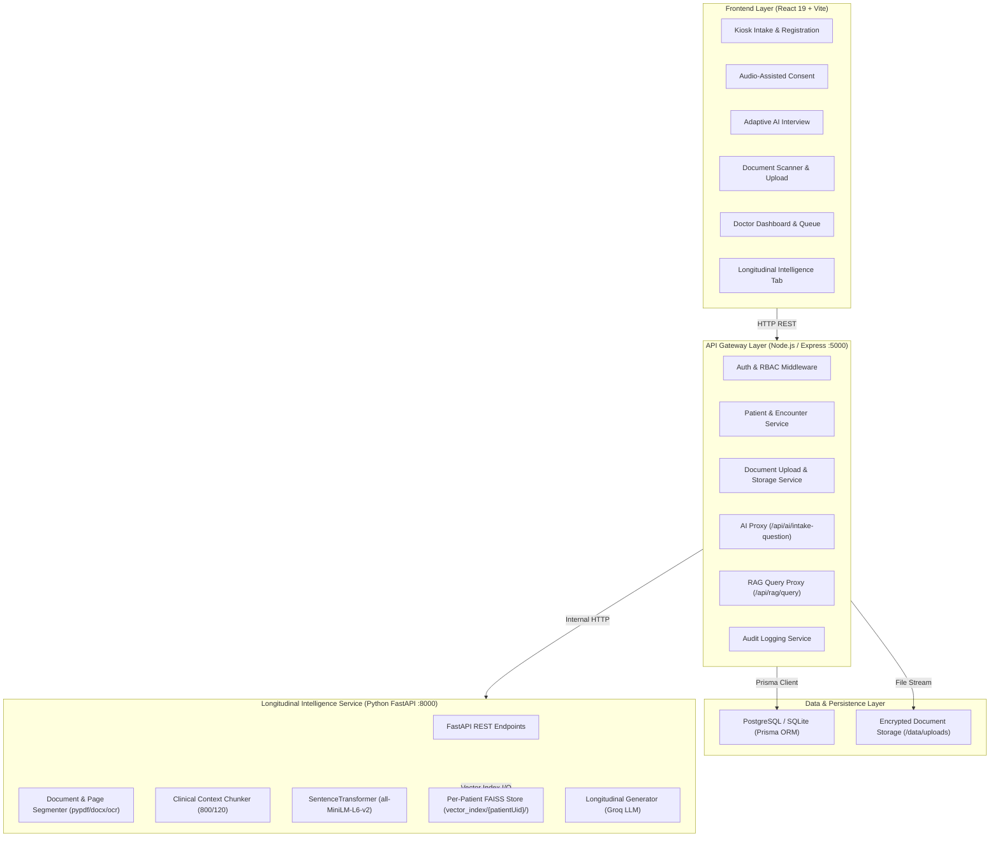

# System Architecture Specification

## 1. High-Level Component Architecture

---

## 2. Core Architectural Principles
1. **Application-Enforced Patient Isolation**: FAISS is treated as a pure vector calculation engine. Isolation is enforced by directory partitioning (`vector_index/{patientUid}/`) and strict gateway authorization.
2. **Deterministic Identifier Mapping**: Immutable `patientUid` (UUID) drives all database foreign keys, vector storage paths, and service-to-service payloads. `patientId` serves human readability.
3. **8-Tier Provenance Taxonomy**: Every retrieved fact, document excerpt, or summary maintains provenance tags (`PATIENT_REPORTED`, `DOCUMENT_EXTRACTED`, `DOCTOR_APPROVED`, etc.).
4. **Resilient Offline Decoupling**: Loss of internet connectivity drops the system into local heuristic mode (`clinicalDialogEngine.js`) without crashing the kiosk.
5. **Three Distinct Session Namespaces**:
   - `ms_device_session`: Kiosk terminal device session (bound to trusted `deviceId` / `terminalId`, TTL 24h. IP address is strictly telemetry/rate-limiting context, NOT primary security identity).
   - `ms_encounter_session`: Ephemeral patient intake session (bound to single `encounterId` and `patientUid`, TTL 2h).
   - `ms_user_session`: Doctor/staff authenticated identity session (role-bearing, TTL 8h).
   - **Boundary Invariant**: A patient encounter session NEVER becomes a doctor identity; a doctor user session is never confused with a patient encounter session.
6. **Trusted Single-Use Handles (Device-Bound vs Staff-Bound)**:
   - Device-created lookup and registration handles are cryptographically bound to `deviceId` / `ms_device_session` (5-min TTL, single-use).
   - Staff-created registration handles are cryptographically bound to `User.id` / `ms_user_session` (5-min TTL, single-use).
   - Prevents replay from unrelated devices or unauthorized user contexts.

7. **Five-Tier Clinical Authorization Policy**: Role `doctor` alone does NOT grant universal patient access. Access is partitioned into 5 explicit categories:
   - *1. Queue Visibility*: An eligible doctor may see minimal queue metadata (`tokenNumber`, `encounterId`, `patientId`, `name`, `age`, `gender`, `priority`, `consultationStatus`, `chiefComplaint`, `chamber`) for encounters in their chamber via `GET /api/queue`. Does NOT expose full clinical history, medications, allergies, or documents.
   - *2. Current Encounter Clinical Access*: Strictly requires `Encounter.assignedDoctorId === req.user.id`. An unclaimed encounter in the chamber queue is NOT accessible for full clinical viewing; the doctor must first claim it via `PUT /api/encounters/:id/claim` (transition: queue-visible → claim → assigned → clinical access granted).
     - **Option B Chamber Rule (IMPLEMENTED)**: `Encounter.chamber` must be explicitly set (non-null) before a doctor can claim. If `Encounter.chamber === null`, the encounter has not been routed by clinical staff and claim is rejected with `403 CHAMBER_ROUTING_REQUIRED`. If `Encounter.chamber !== req.user.chamber`, claim is rejected with `403 CHAMBER_MISMATCH`.
     - *CareRelationship Lifecycle*: `ATTENDING_OPD` established at claim with `status = "active"` and `expiresAt = null`. Upon consultation completion, `expiresAt` is finalized to `completedAt + 24h`. Manual lifecycle routes: `POST /api/care-relationships` (PRIMARY_PHYSICIAN/SPECIALIST_REFERRAL), `PUT /api/care-relationships/:id/suspend`, `PUT /api/care-relationships/:id/end`.
   - *3. Longitudinal Patient Access*: Doctor authorized via active CareRelationship (`PRIMARY_PHYSICIAN`, `SPECIALIST_REFERRAL`, or active `ATTENDING_OPD` within 24h of completion). Suspended, ended, and expired relationships do NOT grant access. Arbitrary browsing without an active CareRelationship is blocked with `403 LONGITUDINAL_ACCESS_DENIED`.
   - *4. Patient Self-Access*: Ephemeral patient session (`ms_encounter_session`) accessing own encounter record.
   - *5. Administrative Access*: Audited access strictly requiring canonical header `X-Admin-Access-Reason` (query string justification prohibited). Stored in `AuditLog.metadataJson` without duplicating resource IDs; `actorUserId` populated strictly from authenticated `req.user.id`.
   - **Universal Rule**: No role alone grants unrestricted clinical patient-record access.
8. **Topology-Aware Cookie & CSRF Security**: Session cookies configured with `HttpOnly`, `Secure` (HTTPS in production), and deployment-aligned `SameSite` (`Lax` for development / cross-port proxy, `Strict` for unified reverse-proxy production). State-changing endpoints strictly validate `X-Requested-With` and Origin/Referer headers against CSRF.
9. **Non-Blocking Asynchronous Password Hashing**: Clinical user authentication utilizes Node.js asynchronous `crypto.scrypt` (N=16384, r=8, p=1, 64-byte keylen) with 16-byte random salts. `scryptSync` is strictly forbidden in request loops. Passwords and hashes are never returned in JSON or logged.

