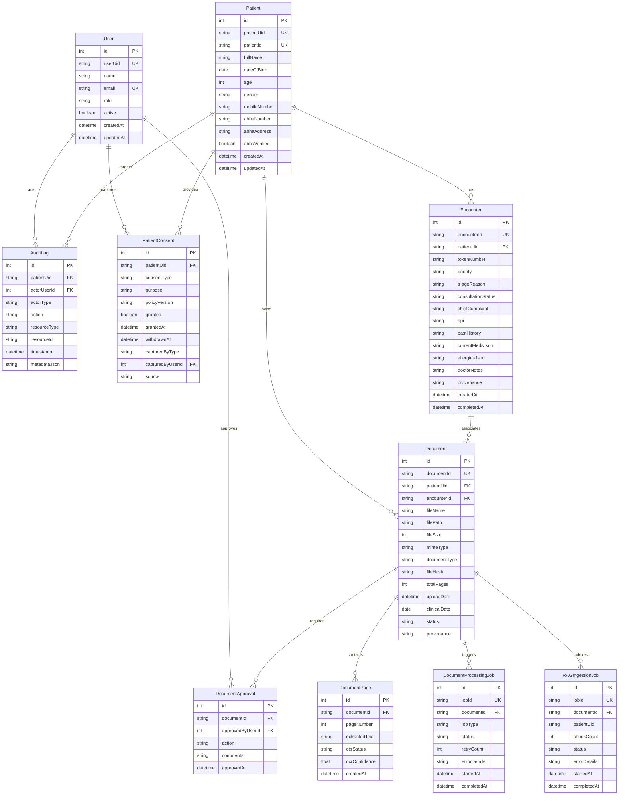

# Canonical Database Schema Specification

## 1. Overview & Provider Strategy

- **Production Database**: PostgreSQL (v15+).
- **Optional Local Development Database**: SQLite (v3.40+) using a separately validated Prisma configuration/migration strategy.
- **Provider Compatibility Rule**:
  - `DATABASE_URL` alone does NOT switch Prisma database providers.
  - The schema uses standard, provider-neutral Prisma types (avoiding PostgreSQL-specific `@db.JsonB` or native enum decorators).
  - All multi-value lists (such as medications, allergies, and dialogue history) are stored either as normalized relational entities or serialized strings verified across both SQLite and PostgreSQL.
  - Compatibility between SQLite and PostgreSQL must be validated by automated integration test suites running migrations and query assertions against both engines.

---

## 2. Entity Relationship Diagram (Mermaid)

---

## 3. Detailed Table Specifications

### 3.1 `User`
Manages authenticated identities for clinicians, administrators, and clinical staff.
- `id` (INTEGER, PK, Auto-increment)
- `userUid` (VARCHAR(36), UNIQUE, NOT NULL): System UUID. Canonical public identifier returned in API responses. Internal numeric `id` is strictly reserved for database relations and audit attribution, not exposed to the client.
- `name` (VARCHAR(255), NOT NULL): e.g. "Dr. K. S. Sharma".
- `email` (VARCHAR(255), UNIQUE, NOT NULL): Login identifier, e.g. "dr.sharma@hospital.gov.in".
- `passwordHash` (TEXT, NULLABLE): Cryptographic hash (scrypt) with salt for local credential verification. Never returned in API responses.
- `salt` (TEXT, NULLABLE): Cryptographic salt for password hashing.
- `role` (VARCHAR(32), NOT NULL): `doctor`, `admin`, `clinical_staff`, `kiosk_operator`.
- `chamber` (VARCHAR(128)): e.g. "OPD Chamber #04 - General Medicine".
- `active` (BOOLEAN, DEFAULT true).
- `createdAt` (TIMESTAMP, NOT NULL).
- `updatedAt` (TIMESTAMP, NOT NULL).

### 3.2 `Patient`
Canonical demographic record.
- `id` (INTEGER, PK, Auto-increment)
- `patientUid` (VARCHAR(36), UNIQUE, NOT NULL): System immutable UUID. Used for vector index filesystem paths (`vector_index/{patientUid}/`).
- `patientId` (VARCHAR(32), UNIQUE, NOT NULL): Human-readable reference (e.g. `PAT-2026-0001`, `SYN-PAT-001`).
- `fullName` (VARCHAR(255), NOT NULL)
- `dateOfBirth` (DATE, NULLABLE)
- `age` (INTEGER, NULLABLE)
- `gender` (VARCHAR(16), NULLABLE)
- `mobileNumber` (VARCHAR(15), NULLABLE, INDEXED): **NOT UNIQUE**. Multiple family members (e.g., pediatric, geriatric, rural households) may share the same contact number. Used as an indexable search signal, not a primary identity key.
- `abhaNumber` (VARCHAR(20), NULLABLE, INDEXED): 14-digit ABHA ID number (`XX-XXXX-XXXX-XXXX`). Unique only where validly verified.
- `abhaAddress` (VARCHAR(100), NULLABLE): Self-selected ABHA address (`name@abdm`).
- `abhaStatus` (VARCHAR(32), NOT NULL, DEFAULT "not_configured"): Authoritative ABHA state. Strictly controlled: `entered`, `lookup_pending`, `verified`, `verification_failed`, `not_configured`, `unavailable`.
- `abhaVerified` (BOOLEAN, DEFAULT false): Invariant: must strictly equal `(abhaStatus === "verified")`. No state may become `verified` without official NHA/ABDM cryptographic confirmation.
- `createdAt` (TIMESTAMP, NOT NULL)
- `updatedAt` (TIMESTAMP, NOT NULL)

### 3.3 `Encounter`
Clinical OPD encounter or intake kiosk session.
- `id` (INTEGER, PK, Auto-increment)
- `encounterId` (VARCHAR(36), UNIQUE, NOT NULL): e.g. `ENC-2026-0001`.
- `patientUid` (VARCHAR(36), FK -> `Patient.patientUid`, NOT NULL)
- `assignedDoctorId` (INTEGER, FK -> `User.id`, NULLABLE): Doctor assigned to this encounter. Enforces doctor-to-patient authorization boundary (`encounter.assignedDoctorId === req.user.id`).
- `chamber` (VARCHAR(64), NULLABLE): OPD Chamber routing identifier (e.g. "OPD Chamber #04 - General Medicine"). Under the implemented **Option B Chamber Rule**, `Encounter.chamber` must be non-null and match `User.chamber` before a doctor can claim the encounter. Encounters with `chamber = null` are rejected with `403 CHAMBER_ROUTING_REQUIRED`.
- `tokenNumber` (VARCHAR(16), NOT NULL): OPD queue token.
- `priority` (VARCHAR(16), DEFAULT "Normal"): `Normal`, `High Priority` (red-flag).
- `triageReason` (TEXT, NULLABLE)
- `consultationStatus` (VARCHAR(20), DEFAULT "waiting"): `waiting`, `in_progress`, `completed`.
- `chiefComplaint` (TEXT, NULLABLE)
- `hpi` (TEXT, NULLABLE)
- `pastHistory` (TEXT, NULLABLE)
- `currentMedsJson` (TEXT, NULLABLE): Serialized JSON array of medications.
- `allergiesJson` (TEXT, NULLABLE): Serialized JSON array of allergies.
- `doctorNotes` (TEXT, NULLABLE): Prescriptions, assessment entered by doctor.
- `intakeConversation` (TEXT, NULLABLE): Serialized interview dialogue.
- `provenance` (VARCHAR(32), DEFAULT "PATIENT_REPORTED")
- `createdAt` (TIMESTAMP, NOT NULL)
- `completedAt` (TIMESTAMP, NULLABLE)

### 3.4 `Document`
Uploaded or scanned medical records.
- `id` (INTEGER, PK, Auto-increment)
- `documentId` (VARCHAR(36), UNIQUE, NOT NULL): e.g. `DOC-2026-0001`.
- `patientUid` (VARCHAR(36), FK -> `Patient.patientUid`, NOT NULL)
- `encounterId` (VARCHAR(36), FK -> `Encounter.encounterId`, NULLABLE)
- `fileName` (VARCHAR(255), NOT NULL)
- `filePath` (VARCHAR(512), NOT NULL)
- `fileSize` (INTEGER, NOT NULL)
- `mimeType` (VARCHAR(64), NOT NULL)
- `documentType` (VARCHAR(64), NOT NULL): `prescription`, `lab_report`, `discharge_summary`, `radiology`, `other`.
- `fileHash` (VARCHAR(64), NULLABLE): SHA-256 hash for deduplication.
- `totalPages` (INTEGER, DEFAULT 1)
- `uploadDate` (TIMESTAMP, NOT NULL): Time file was uploaded to the server.
- `clinicalDate` (DATE, NULLABLE): Actual date of the medical report or visit (distinguished from uploadDate).
- `status` (VARCHAR(32), DEFAULT "uploaded"): `uploaded`, `processing`, `ready`, `failed`.
- `provenance` (VARCHAR(32), DEFAULT "DOCUMENT_EXTRACTED")

### 3.5 `DocumentPage`
Page-level text and OCR metadata for high-fidelity RAG citations.
- `id` (INTEGER, PK, Auto-increment)
- `documentId` (VARCHAR(36), FK -> `Document.documentId`, NOT NULL)
- `pageNumber` (INTEGER, NOT NULL): 1-indexed page number.
- `extractedText` (TEXT, NOT NULL): Cleaned text extracted from this specific page.
- `ocrStatus` (VARCHAR(32), DEFAULT "native_text"): `native_text`, `ocr_processed`, `ocr_failed`.
- `ocrConfidence` (FLOAT, NULLABLE): Extraction confidence score (0.0 - 1.0).
- `createdAt` (TIMESTAMP, NOT NULL)

### 3.6 `DocumentProcessingJob`
Asynchronous text extraction and OCR job tracking.
- `id` (INTEGER, PK, Auto-increment)
- `jobId` (VARCHAR(36), UNIQUE, NOT NULL)
- `documentId` (VARCHAR(36), FK -> `Document.documentId`, NOT NULL)
- `jobType` (VARCHAR(32), NOT NULL): `TEXT_EXTRACTION`, `OCR_ENHANCEMENT`.
- `status` (VARCHAR(32), DEFAULT "queued"): `queued`, `processing`, `completed`, `failed`.
- `retryCount` (INTEGER, DEFAULT 0)
- `errorDetails` (TEXT, NULLABLE)
- `startedAt` (TIMESTAMP, NULLABLE)
- `completedAt` (TIMESTAMP, NULLABLE)

### 3.7 `DocumentApproval`
Physician review record before clinical RAG indexing.
- `id` (INTEGER, PK, Auto-increment)
- `documentId` (VARCHAR(36), FK -> `Document.documentId`, NOT NULL)
- `approvedByUserId` (INTEGER, FK -> `User.id`, NOT NULL): Relational reference to reviewing clinician.
- `action` (VARCHAR(32), NOT NULL): `APPROVED`, `REJECTED`, `REQUIRES_RESCAN`.
- `comments` (TEXT, NULLABLE)
- `approvedAt` (TIMESTAMP, NOT NULL)

### 3.8 `RAGIngestionJob`
Tracks vector chunking, embedding generation, and FAISS index persistence.
- `id` (INTEGER, PK, Auto-increment)
- `jobId` (VARCHAR(36), UNIQUE, NOT NULL)
- `documentId` (VARCHAR(36), FK -> `Document.documentId`, NOT NULL)
- `patientUid` (VARCHAR(36), NOT NULL): Namespace target (`vector_index/{patientUid}/`).
- `chunkCount` (INTEGER, DEFAULT 0)
- `status` (VARCHAR(32), DEFAULT "queued"): `queued`, `indexing`, `completed`, `failed`.
- `errorDetails` (TEXT, NULLABLE)
- `startedAt` (TIMESTAMP, NULLABLE)
- `completedAt` (TIMESTAMP, NULLABLE)

### 3.9 `PatientConsent`
Purpose-aware healthcare consent tracking.
- `id` (INTEGER, PK, Auto-increment)
- `patientUid` (VARCHAR(36), FK -> `Patient.patientUid`, NOT NULL)
- `consentType` (VARCHAR(64), NOT NULL): `data_collection`, `ai_processing`, `document_processing`, `record_sharing`, `abha_integration`.
- `purpose` (TEXT, NOT NULL): Plain-language explanation of processing scope.
- `policyVersion` (VARCHAR(16), NOT NULL): e.g. "v1.2-2026".
- `granted` (BOOLEAN, NOT NULL)
- `grantedAt` (TIMESTAMP, NOT NULL)
- `withdrawnAt` (TIMESTAMP, NULLABLE)
- `capturedByType` (VARCHAR(32), NOT NULL): `kiosk_self`, `staff_assisted`, `verbal_with_witness`.
- `capturedByUserId` (INTEGER, FK -> `User.id`, NULLABLE)
- `source` (VARCHAR(64), DEFAULT "medsync_kiosk")

### 3.10 `AuditLog`
Immutable audit trail for HIPAA/DPDP/ABDM clinical accountability. Supports multi-actor provenance without fabricating User records for hardware or backend services.
- `id` (INTEGER, PK, Auto-increment)
- `patientUid` (VARCHAR(36), FK -> `Patient.patientUid`, NULLABLE)
- `actorType` (VARCHAR(16), NOT NULL): `USER`, `DEVICE`, `SERVICE`, `SYSTEM`.
- `actorUserId` (INTEGER, FK -> `User.id`, NULLABLE): Required when `actorType === "USER"`; strictly populated from server-side `req.user.id`. Must be NULL for `DEVICE`, `SERVICE`, `SYSTEM`.
- `actorDeviceId` (VARCHAR(64), NULLABLE): Required when `actorType === "DEVICE"` (e.g. `KIOSK-TERMINAL-01`). Must be NULL for `USER`, `SERVICE`, `SYSTEM`.
- `actorService` (VARCHAR(64), NULLABLE): Required when `actorType === "SERVICE"` (e.g. `fastapi-rag-service`, `document-ocr-worker`). Must be NULL for `USER`, `DEVICE`, `SYSTEM`.
- `action` (VARCHAR(64), NOT NULL): `VIEW_RECORD`, `PATIENT_LOOKUP`, `REGISTER_PATIENT`, `CREATE_ENCOUNTER`, `CLAIM_ENCOUNTER`, `RUN_RAG_QUERY`, `UPLOAD_DOC`, `APPROVE_DOC`, `COMPLETE_OPD`.
- `resourceType` (VARCHAR(32), NOT NULL): `patient`, `document`, `encounter`, `care_relationship`, `rag_query`.
- `resourceId` (VARCHAR(64), NULLABLE)
- `timestamp` (TIMESTAMP, NOT NULL, DEFAULT now())
- `metadataJson` (TEXT, NULLABLE): Sanitized event context (e.g. `{ "accessReason": "..." }` from `X-Admin-Access-Reason`; never contains passwords, raw PHI, or session secrets). Dedicated fields `patientUid`, `resourceType`, and `resourceId` are NOT duplicated inside `metadataJson`. `actorUserId` is strictly populated from server-side authenticated `req.user.id`, never accepted from client inputs.

> **Audit Invariants**:
> 1. `USER`: `actorUserId` required, `actorDeviceId: null`, `actorService: null`.
> 2. `DEVICE`: `actorDeviceId` required, `actorUserId: null`, `actorService: null`.
> 3. `SERVICE`: `actorService` required, `actorUserId: null`, `actorDeviceId: null`.
> 4. `SYSTEM`: `actorUserId: null`, `actorDeviceId: null`, `actorService: null`.
> 5. Audit actor identity is **NEVER accepted from the frontend**. For `USER` actions, `actorUserId` strictly originates from verified server session `req.user.id`.

### 3.11 `CareRelationship` ⭐ NEW (Phase 4 Longitudinal Access Control)
Manages clinical authorization for longitudinal medical record access beyond an ephemeral OPD encounter. Distinguishes current encounter access from longitudinal care history.
- `id` (INTEGER, PK, Auto-increment)
- `patientUid` (VARCHAR(36), FK -> `Patient.patientUid`, NOT NULL)
- `doctorId` (INTEGER, FK -> `User.id`, NOT NULL): Authorized clinician receiving the care relationship.
- `relationshipType` (VARCHAR(32), NOT NULL):
  - `ATTENDING_OPD`: Automatic encounter-linked care relationship established upon OPD encounter claim.
  - `PRIMARY_PHYSICIAN`: Long-term general care relationship authorized for chronic disease management.
  - `SPECIALIST_REFERRAL`: Time-bounded consultation access (e.g., Cardiology consult).
- `status` (VARCHAR(16), DEFAULT "active"): `active`, `suspended`, `ended`.
- `encounterId` (VARCHAR(36), FK -> `Encounter.encounterId`, NULLABLE): Linked encounter for `ATTENDING_OPD` relationships.
- `createdAt` (TIMESTAMP, NOT NULL, DEFAULT now()): Establishment timestamp.
- `expiresAt` (TIMESTAMP, NULLABLE): Automatic expiration timestamp. For `ATTENDING_OPD`: remains `null` at initial claim time while consultation is in progress, and is finalized to `completedAt + 24 hours` upon consultation completion (`PUT /api/patient/:token/complete`).
- `endedAt` (TIMESTAMP, NULLABLE): Explicit termination timestamp when clinician or admin closes the relationship.
- `assignedByUserId` (INTEGER, FK -> `User.id`, NULLABLE): Clinician or Administrator who established or transferred the relationship.

> [!NOTE]
> **Prisma Dual-Relation Semantics**:
> Both `doctorId` and `assignedByUserId` reference the `User` model. The implementation must define these as two distinct, named Prisma relations:
> - `doctor User @relation("CareRelationshipDoctor", fields: [doctorId], references: [id])`
> - `assignedByUser User? @relation("CareRelationshipAssignedBy", fields: [assignedByUserId], references: [id])`
> On the `User` model:
> - `careRelationshipsReceived CareRelationship[] @relation("CareRelationshipDoctor")`
> - `careRelationshipsAssigned CareRelationship[] @relation("CareRelationshipAssignedBy")`
> If implementation later determines `assignedByUserId` does not need a relational reference, that must be an explicit design decision rather than an accidental omission.
- `notes` (TEXT, NULLABLE): Clinical justification or referral notes.

