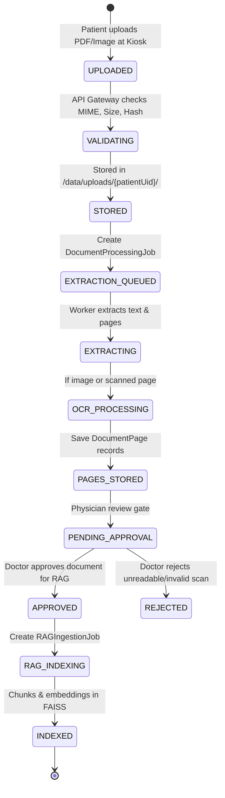

# Document Processing, Page Segmentation & Provenance Lifecycle

## 1. Document Lifecycle Architecture

Medical documents uploaded during patient intake (such as previous discharge summaries, OPD prescription slips, and diagnostic laboratory panels) follow an explicit, multi-stage operational lifecycle.



---

## 2. Decoupled Entities & Responsibilities

| Entity | Purpose | Key Attributes |
| :--- | :--- | :--- |
| **`Document`** | Canonical file record | `documentId`, `patientUid`, `fileName`, `filePath`, `fileSize`, `mimeType`, `fileHash`, `totalPages`, `uploadDate`, `clinicalDate`. |
| **`DocumentPage`** | Page-level segmentation | `documentId`, `pageNumber` (1-indexed), `extractedText`, `ocrStatus` (`native_text`, `ocr_processed`), `ocrConfidence`. |
| **`DocumentProcessingJob`** | Extraction execution tracking | `jobId`, `documentId`, `jobType`, `status` (`queued`, `processing`, `completed`, `failed`), `retryCount`, `errorDetails`. |
| **`DocumentApproval`** | Clinical verification gate | `documentId`, `approvedByUserId` (FK to `User`), `action` (`APPROVED`, `REJECTED`), `comments`, `approvedAt`. |
| **`RAGIngestionJob`** | Vector pipeline tracking | `jobId`, `documentId`, `patientUid`, `chunkCount`, `status` (`queued`, `indexing`, `completed`, `failed`), `errorDetails`. |

---

## 3. Temporal Distinction: `uploadDate` vs `clinicalDate`

> [!IMPORTANT]
> The system strictly separates **`uploadDate`** from **`clinicalDate`**:
> - **`uploadDate`**: The server timestamp when the file was physically received by the MedSync kiosk (e.g. `2026-09-19 10:14:00`).
> - **`clinicalDate`**: The historical date when the clinical encounter, consultation, or laboratory test actually took place (e.g. `2021-04-12`).
> 
> The longitudinal timeline and RAG chronological sorting use **`clinicalDate`** (or extracted year metadata), NEVER `uploadDate`. If a clinical date cannot be reliably determined from the document header or doctor review, it is marked as `UNKNOWN_DATE` and presented with appropriate uncertainty disclaimers.

---

## 4. End-to-End Page-Aware Citation Pipeline

To guarantee that doctors receive exact, verifiable source attribution without fabricated citations:

```
Document Upload (PDF/Image)
       │
       ▼
Page Segmentation (pypdf / OCR)
       │   Yields explicit page numbers: Page 1, Page 2, ... Page N
       ▼
Page Text Storage (`DocumentPage`)
       │   `extractedText` stored per `pageNumber`
       ▼
Chunking (`chunker.py`)
       │   Each chunk retains:
       │   - `patient_uid`
       │   - `document_id`
       │   - `document_name`
       │   - `page_number` (e.g. 2)
       │   - `clinical_year` (e.g. 2022)
       │   - `provenance` (`DOCUMENT_EXTRACTED` or `OCR_EXTRACTED`)
       ▼
Dense Embeddings (MiniLM-L6-v2)
       │
       ▼
Per-Patient FAISS Index (`vector_index/{patientUid}/`)
       │
       ▼
Retrieval Result (`rag_pipeline.py`)
       │   Returns top-k chunks with explicit `page_number`
       ▼
LLM Context Construction (`generator.py`)
       │   Grounds response using: "[DOC: Discharge_Summary.pdf | PAGE: 2 | YEAR: 2022]"
       ▼
Doctor Dashboard UI
           Renders clickable source pill:
           "[Source: Discharge_Summary.pdf, Page 2 (2022)]"
           Clicking opens the document directly scrolled to Page 2.
```

### Fallback Citation Rules:
- If a document is a single-page prescription or plaintext file with no page structure: citation reports document-level source: `[Source: OPD_Prescription.txt (2024)]`.
- Page numbers are **never** fabricated. If `pageNumber` is null, the UI states `"Page number unavailable"`.
