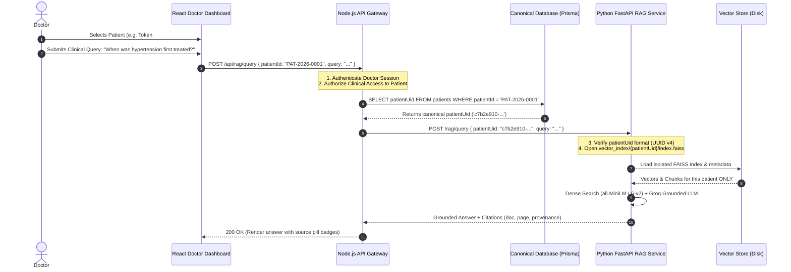

# Patient Identity & Data Isolation Architecture

## 1. Dual-Identifier Architecture

To ensure multi-tenant safety, long-term integrity, and clinician usability, patient identity is decoupled into two distinct representations:

| Identifier | Type | Format | Scope & Purpose |
| :--- | :--- | :--- | :--- |
| **`patientUid`** | System Immutable | RFC 4122 UUID v4 (e.g. `c7b2e910-1a84-4e2b-9e41-692147819382`) | **Internal canonical identifier**. Used for primary foreign keys, database joins, API authorization tokens, and vector storage directory names (`vector_index/{patientUid}/`). |
| **`patientId`** | Human-Readable | Alphanumeric (e.g. `PAT-2026-0001`, `P-8801`, `SYN-PAT-001`) | **Clinician & patient-facing display**. Used in OPD queue lists, physical paper case summaries, barcode stickers, and front-desk lookups. |

---

## 2. Vector Storage Namespace Rules

1. **Namespace Isolation**:
   Vector indices on the filesystem MUST be partitioned strictly by `patientUid`:
   ```
   vector_index/
   ├── c7b2e910-1a84-4e2b-9e41-692147819382/
   │   ├── index.faiss
   │   ├── chunks.pkl
   │   └── .lock
   └── d9e41982-3b12-4f11-8a91-782194819001/
       ├── index.faiss
       ├── chunks.pkl
       └── .lock
   ```
2. **Canonical Mapping for Synthetic Data (`SYN-PAT-001`)**:
   The pre-existing 15-year synthetic dataset for `SYN-PAT-001` (Arjun Mehta) is mapped to a deterministic canonical UUID in the seed database (e.g. `00000000-0000-0000-0000-000000000001`). Its vector directory is stored under that UUID namespace, guaranteeing zero migration breakage while adhering to UUID path standards.
3. **Path Traversal Protection**:
   Raw user strings from search inputs, HTTP headers, or form fields are **never** passed directly to filesystem path builders. The API Gateway verifies authorization, queries the canonical `patientUid` from PostgreSQL/SQLite, and passes only the validated UUID string to the vector store resolver.

---

## 3. End-to-End Resolution & Query Flow



---

## 4. Patient Registration & Deduplication Policy (Phase 4 Revised)

### 4.1 Mobile Number Rule: Non-Unique Matching Signal & Shared Mobile Flow
- **`mobileNumber` is NOT universally unique**: Multiple family members (e.g., parent and pediatric child, adult child and elderly grandparent, rural households with a single shared handset) share the same mobile phone.
- **Normalization & Indexing**: Mobile numbers are normalized to standard 10-digit format and indexed for search queries.
- **Shared Mobile Candidate Flow**:
  1. Mobile lookup returns an array of matched `candidates: [...]`.
  2. Each candidate displays minimal masked identity information (`fullName`, `patientId`, `maskedMobile`, `age`, `gender`).
  3. The kiosk user explicitly selects:
     - Candidate A ("Yes, this is Rahul Kumar") $\rightarrow$ Proceeds with Candidate A.
     - Candidate B ("Yes, this is Priya Kumar") $\rightarrow$ Proceeds with Candidate B.
     - "None of these / Register New Patient" $\rightarrow$ Directs to new patient registration with this shared mobile number.
  4. **Zero Silent Merge**: The system never merges records automatically and never defaults to the first matched candidate.

### 4.2 Duplicate Prevention & Identification Multi-Signal Rule
Deduplication evaluates multiple signals rather than a single database constraint:
1. **Verified ABHA Number**: If an ABHA number is officially verified via ABDM gateway, it represents a unique individual identity.
2. **Normalized Mobile Number + Demographic Context**: Mobile number combined with Full Name and Age / Date of Birth.
3. **Explicit Patient / Operator Confirmation**: The system **never silently merges** two patient records. If a potential match is found, the system presents a masked preview and requires explicit confirmation ("Is this you?").
4. **Audit Trail of Identity Decisions**: Every decision to associate a new encounter with an existing patient or create a new patient on a shared mobile is recorded in the clinical audit log.

---

## 5. Privacy-Preserving Patient Lookup & Registration Flows

The platform enforces two distinct, secure intake pathways:

### 5.1 Pathway A: Returning Patient Lookup Flow (Kiosk-Bound Context)

```
[ Kiosk Terminal ] ─── Enters Mobile / ABHA ───► [ POST /api/patients/lookup ]
(Holding ms_device_session)                              │
                                                   Rate Limiter (10 req/min) & Regex Validation
                                                   ms_device_session Check & Anti-Enumeration Defense
                                                   Database Query (Normalized Match)
                                                         │
                                        ┌────────────────┴────────────────┐
                                  [ Candidates Found ]              [ Not Found ]
                                        │                                 │
                           Generate Short-Lived Handle             Returns { found: false, candidates: [] }
                           (lookupHandle: 5-min TTL in RAM;
                            bound to ms_device_session + candidates)
                                        │
                                        ▼
                           Return Masked Candidates Array:
                           - found: true
                           - lookupHandle: "lh_8f1a2b3c..."  (NEVER patientUid)
                           - candidates: [
                               { candidateId: "cand_1", patientId: "PAT-2026-0004", fullName: "R**** K****", maskedMobile: "******3210", age: 48, gender: "Male" },
                               { candidateId: "cand_2", patientId: "PAT-2026-0012", fullName: "P**** K****", maskedMobile: "******3210", age: 14, gender: "Female" }
                             ]
                                        │
                           [ User Selects Candidate ]
                                        │
                                        ▼
[ Kiosk Terminal ] ─── POST /api/encounters { lookupHandle, candidateId, chiefComplaint } ───► [ Server ]
(Sending ms_device_session cookie)                                                                  │
                                                1. Verify lookupHandle matches ms_device_session
                                                2. Verify candidateId belongs to handle
                                                3. Invalidate lookupHandle immediately (single-use)
                                                4. Create Encounter (ENC-2026-XXXX)
                                                5. Issue ms_encounter_session cookie (HttpOnly)
                                                (patientUid never exposed to client)
```

### 5.2 Pathway B: New Patient Registration Flow (Registration Handle Lifecycle)

To guarantee that a rogue client cannot submit an arbitrary `patientUid` to fabricate an encounter:

```
[ Kiosk Terminal / Staff UI ] ─── POST /api/patients { fullName, age, gender, mobileNumber } ───► [ Server ]
(Holding ms_device_session or ms_user_session)                                                          │
                                                    1. Authorize caller (kiosk device or staff role)
                                                    2. Create canonical Patient record (generates patientUid)
                                                    3. Generate registrationHandle (rh_..., 5-min TTL,
                                                       bound to ms_device_session + patientUid)
                                                                │
                                                                ▼
                                                    201 Created {
                                                      registrationHandle: "rh_9a2b3c4d...",
                                                      patient: { patientId: "PAT-2026-0017", fullName: "..." }
                                                    } (Zero raw patientUid returned)
                                                                │
                                                                ▼
[ Kiosk Terminal ] ─── POST /api/encounters { registrationHandle, chiefComplaint, priority } ───► [ Server ]
(Sending ms_device_session cookie)                                                                  │
                                                1. Verify registrationHandle matches ms_device_session
                                                2. Resolve registrationHandle -> patientUid
                                                3. Invalidate registrationHandle immediately (single-use)
                                                4. Create Encounter (ENC-2026-XXXX)
                                                5. Issue ms_encounter_session cookie (HttpOnly)
```

**Security & Anti-Enumeration Guarantees**:
- **Zero Raw `patientUid` Submission**: `POST /api/encounters` strictly accepts `lookupHandle` OR `registrationHandle`. Direct submission of an arbitrary `patientUid` is rejected with **`400 BAD_REQUEST (HANDLE_REQUIRED)`**.
- **Anti-Enumeration Defense**:
  - `POST /api/patients/lookup` enforces IP/terminal rate limiting (10 req/min).
  - Pre-query regex validation blocks malformed probes.
  - Names are aggressively masked (`R**** K****`), mobile numbers display only last 4 digits.
  - Zero medical history, zero past encounters, and zero uploaded documents are revealed during lookup.
  - Consistent query latency mitigates timing probes.
- **Kiosk Context Binding**: Handles (`lh_...` and `rh_...`) are cryptographically bound to the initiating `ms_device_session`. Replays from other devices fail with **`403 FORBIDDEN (HANDLE_CONTEXT_MISMATCH)`**.

---

## 6. Doctor-to-Patient Clinical Access & CareRelationship Lifecycle

A user having `role == "doctor"` does **NOT** grant unrestricted access to every patient in the database. The platform enforces three distinct access tiers:

1. **Current Encounter Access**:
   - **Rule**: Doctor can view and document an encounter IF `encounter.assignedDoctorId === req.user.id`, OR the encounter is in `waiting` status in the doctor's assigned OPD chamber and the doctor explicitly claims it (`PUT /api/encounters/:id/claim`).
   - **Enforcement**: Unassigned doctors attempting access receive **`403 FORBIDDEN (CLINICAL_ACCESS_DENIED)`**.
2. **Longitudinal Patient History Access**:
   - **Rule**: Governed by the `CareRelationship` model.
   - **CareRelationship Lifecycle**:
     - At OPD claim (`PUT /api/encounters/:id/claim`): `CareRelationship` is created with `status = "active"` and `expiresAt = null` (active while consultation is pending or in progress; 24h expiration is NOT assigned at claim).
     - At consultation completion (`PUT /api/patient/:token/complete`): `completedAt` is set, and active `ATTENDING_OPD` `expiresAt` is finalized to `completedAt + 24h`. Doctor can view historical encounters, past lab reports, and query the longitudinal RAG engine IF an active `CareRelationship` exists (`PRIMARY_PHYSICIAN`, `SPECIALIST_REFERRAL`, or active `ATTENDING_OPD` within 24h of encounter completion).
   - **Enforcement**: Arbitrary browsing of historical patient records without an active care relationship is blocked with **`403 FORBIDDEN (LONGITUDINAL_ACCESS_DENIED)`**.
3. **Administrative Access**:
   - **Rule**: `admin` role is restricted to system-level configuration, user management, and compliance audit trail inspection. Cannot view clinical records or diagnosis notes without an audited emergency justification.
   - **Canonical Header Enforcement**: Admin clinical access strictly requires the canonical header `X-Admin-Access-Reason: <reason>` (query string parameters are prohibited to prevent access justification leakage into browser history and proxy access logs).
   - **Audit Trail**: Writes `AuditLog` entry with `actorType: "USER"`, `actorUserId` populated strictly from authenticated session `req.user.id` (never accepted from client), and `metadataJson: { "accessReason": "..." }`.
4. **Emergency Override (Break-Glass)**:
   - Clinicians in emergency situations may access patient records by providing an explicit reason, triggering an immediate high-priority audit log entry for institutional review.
