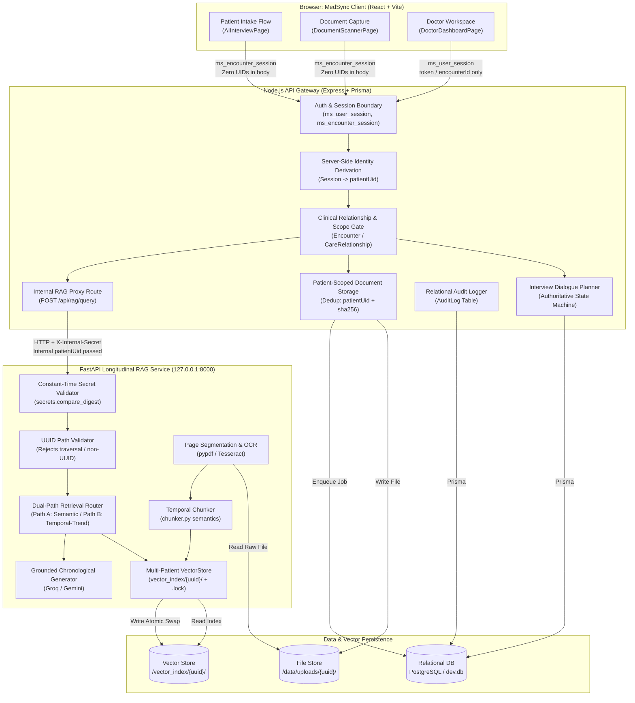
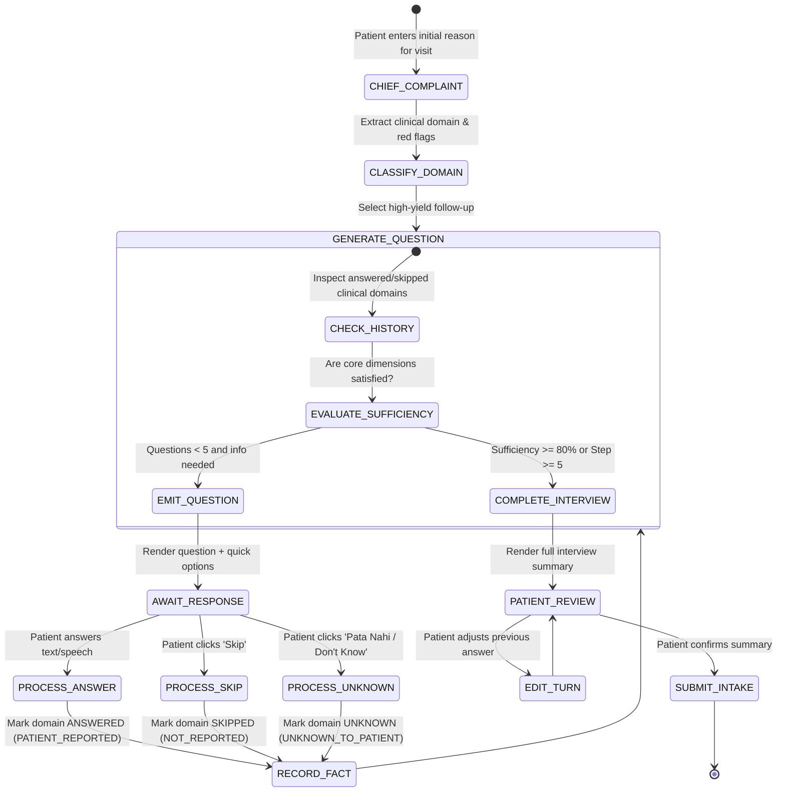
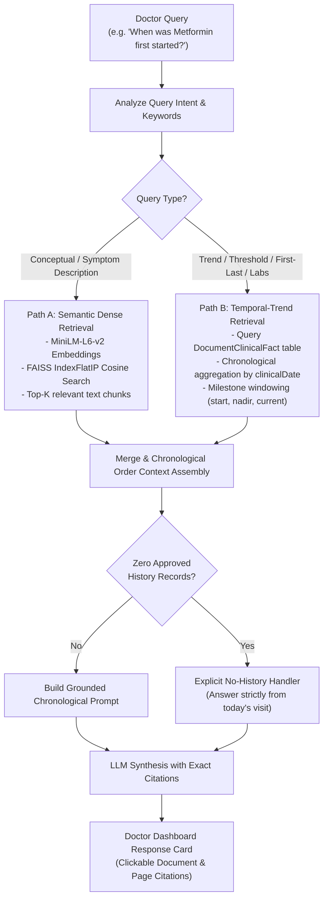

# Phase 5 Implementation Plan: Longitudinal Clinical Intelligence Integration
## MedSync Kiosk Intake + AuraHealth Nexus RAG Architecture

**Version**: 1.1.0-PROPOSED (Consolidated Architecture Review Edition)
**Status**: DRAFT / ARCHITECTURAL BLUEPRINT — PENDING APPROVAL
**Branch**: `integration/phase-5`
**Base Commit / Tag**: `phase-4-complete` (`fd65c6f`)

---

## 1. Objectives & AuraHealth Source-of-Truth Rule

The primary objective of **Phase 5** is to synthesize the **MedSync Clinical Kiosk** (patient identity, privacy-preserving intake, and OPD orchestration) and the **AuraHealth Nexus Engine** (15-year longitudinal medical history RAG) into a single, unified, privacy-enforced clinical intelligence workflow.

```
                  ┌─────────────────────────────────────────────────────────┐
                  │                 MEDSYNC KIOSK FRONTEND                  │
                  │  Identity → Consent → Adaptive Intake → Doc Scan/Upload │
                  │  (Zero patientUid / patientId accepted or exposed)      │
                  └────────────────────────────┬────────────────────────────┘
                                               │ HTTPS / Session Cookies
                                               ▼
                  ┌─────────────────────────────────────────────────────────┐
                  │                   NODE.JS API GATEWAY                   │
                  │  Auth / RBAC / Sessions / CareRel / Auditing / Storage  │
                  │  (Derives patientUid internally; gates RAG access)      │
                  └─────────────┬─────────────────────────────┬─────────────┘
                                │                             │
                   Prisma / DB  │                             │ HTTP / 127.0.0.1:8000
                                ▼                             ▼ Constant-Time Secret
                  ┌───────────────────────────┐ ┌───────────────────────────┐
                  │   POSTGRESQL / SQLITE     │ │     FASTAPI RAG ENGINE    │
                  │ Patients, Encounters, Docs│ │ Dual-Path Retrieval       │
                  │ Pages, Facts, Audit Logs  │ │ vector_index/{uuid}/      │
                  │ CareRelationships, State  │ │ LLM Temporal Synthesizer  │
                  └───────────────────────────┘ └───────────────────────────┘
```

### AuraHealth Source-of-Truth Rule:
1. **Reference Semantics**: The existing AuraHealth research implementation (`aiml-crash-yash-verma-Aurahealth_final_project/`) remains the authoritative behavioral reference for retrieval routing, chronological sorting, temporal chunk formatting, and evidence-grounded generation.
2. **Untouched Research Artifacts**: The original AuraHealth research/demo files (`app.py`, `rag_pipeline.py`, `chunker.py`, `loader.py`, `vectorstore.py`, `generator.py`, `evaluate.py`, and `vector_index/SYN-PAT-001/`) remain **100% untouched and preserved** for independent demonstration via `npm run dev:streamlit`.
3. **Mandatory Regression Corpus**: `SYN-PAT-001` (15 annual records covering 2010–2024) serves as a mandatory, deterministic regression corpus for all Phase 5 RAG validation.
4. **Preserved Semantics in Production**: Production refactoring in `services/rag_service/` must strictly mirror the retrieval and generation semantics of the reference code while adding multi-tenant isolation, process locking, and dual-path retrieval.

---

## 2. High-Level Architecture & Component Boundaries

Phase 5 strictly adheres to the security perimeter established in Phases 1–4:



### Architectural Guardrails:
1. **Public API Identity Invariance**: Public browser APIs **never** accept or expose `patientUid` or `patientId`. Patient identity is derived server-side exclusively from authenticated session context (`ms_encounter_session`) or authorized clinical assignment (`Encounter.assignedDoctorId` / `CareRelationship`).
2. **Internal Network Placement**: The FastAPI service binds strictly to `127.0.0.1:8000`. No external ingress or browser CORS is permitted (`allow_origins = []`).
3. **Constant-Time Mutual Secret**: Communication from Node to FastAPI requires `X-Internal-Secret`, validated via `secrets.compare_digest` to eliminate timing side-channels.
4. **Physical Storage Isolation**: Vector indices are stored at `vector_index/{canonicalPatientUid}/` only, where `canonicalPatientUid` is validated against strict UUID regex before any filesystem operation.

---

## 3. Current-State Repository Audit

An exhaustive audit of the frozen Phase 4 codebase reveals the current baseline capabilities and explicit technical debt:

### A. MedSync Frontend (`Patient-case-taking-software-/src/`)
- **React Pages**: 14 view components routed via `DemoContext` state (`activeTab`).
- **`AIInterviewPage.jsx`**:
  - Contains a fixed 6-step progress bar (`CLINICAL_STEPS`).
  - Calls Node proxy `POST /api/ai/intake-question` with `patientMessage`, `conversationHistory`, and demographic context.
  - Implements an offline fallback to `clinicalDialogEngine.js`.
  - **Deficiency**: Lacks dynamic branching, skips, "I don't know" handling, and pre-submission answer review.
- **`DocumentScannerPage.jsx`**:
  - Renders scanner UI, camera capture, and file upload dropzones.
  - **Deficiency**: Contains simulated `setTimeout` progress bars (lines 51–105) and hardcodes clinical data based on file name substrings (lines 109–165). Does not invoke a backend upload route.
- **`OCRResultsPage.jsx`**:
  - Displays mock extraction results (medications, diagnosis, problems).
  - **Deficiency**: Reads from `mockSampleDocuments` rather than live backend database records.
- **`DoctorDashboardPage.jsx`**:
  - Implements queue viewing, encounter claiming (Option B chamber-routing compliant), consultation completion, and document viewing.
  - **Deficiency**: Zero RAG query integration. Doctors cannot query historical patient records using natural language.

### B. MedSync Node Backend (`Patient-case-taking-software-/server.js`)
- **Implemented Security**: Async `scrypt` auth, multi-layer CSRF check, 3 session namespaces (`ms_device_session: 24h`, `ms_encounter_session: 2h`, `ms_user_session: 8h`), Option B chamber routing, atomic conditional claim race handling, and strict CareRelationship lifecycle management.
- **Document Routes**: No document upload, page listing, or approval endpoints currently implemented.
- **RAG Route**: `POST /api/rag/query` currently returns HTTP 501 `NOT_IMPLEMENTED` (stub).

### C. Prisma Schema (`prisma/schema.prisma` & `prisma/schema.sqlite.prisma`)
- Models `Document`, `DocumentPage`, `DocumentProcessingJob`, `DocumentApproval`, and `RAGIngestionJob` are already defined in both PostgreSQL and SQLite schemas from Phase 2.
- **Deficiency**: Missing tables for structured clinical fact extraction (`DocumentClinicalFact`), interview dialogue sessions (`InterviewSession`, `InterviewTurn`), and RAG query auditing (`RAGQueryAudit`).

### D. AuraHealth Implementation (`aiml-crash-yash-verma-Aurahealth_final_project/`)
- **Strengths**: High-quality longitudinal RAG logic:
  - `loader.py`: Extracts text and metadata from `.txt`, `.pdf`, `.docx`.
  - `chunker.py`: Preserves temporal metadata (`year`, `patient_id`) in chunk headers.
  - `vectorstore.py`: `all-MiniLM-L6-v2` dense embeddings, normalized cosine similarity via `faiss.IndexFlatIP`.
  - `rag_pipeline.py`: 4 query strategies (`TIMELINE_SUMMARY`, `SPECIFIC_YEAR`, `LONGITUDINAL_TREND`, `STANDARD_SEMANTIC`), chronological context sorting, and confidence scoring.
  - `generator.py`: Grounded prompts with strict chronology and year citations.
- **Deficiencies for Production**:
  - Hardcoded to single patient `SYN-PAT-001`.
  - Standalone Streamlit application (`app.py`); no HTTP API interface for Node.js.
  - Ingestion lacks OCR for scanned image PDFs.
  - Vector index lacks multi-tenant concurrency controls and process locking.

---

## 4. Reusable vs. New Components Matrix

| Component | Status | Classification | Reusability Strategy |
| :--- | :--- | :--- | :--- |
| **`rag_pipeline.py`** | Implemented | **A. Reusable** | Reuse 4-mode query analysis, chronological context assembly, and confidence scoring directly in the FastAPI service. |
| **`chunker.py`** | Implemented | **A. Reusable** | Reuse temporal header injection (`[{patient_id} \| Year: {year}]`) and semantic chunk splitting. |
| **`vectorstore.py`** | Implemented | **B. Partially Implemented** | Refactor storage paths from static `vector_index/SYN-PAT-001` to dynamic `vector_index/{patientUid}/` with file locking. |
| **`generator.py`** | Implemented | **A. Reusable** | Reuse chronological system prompts, query contextualization, and citation constraints. Add Gemini 2.0 Flash fallback. |
| **`app.py` (Streamlit)** | Implemented | **E. Research/Demo Only** | Preserve untouched in original folder for standalone research demo. Do not use in production runtime. |
| **Frontend Intake UI** | Implemented | **B. Partially Implemented** | Refactor `AIInterviewPage.jsx` from static 6 steps to dynamic complaint-driven planner with skip/edit controls. |
| **Frontend Doc Scanner** | Mocked | **C. Placeholder / Mock** | Replace simulated `setTimeout` in `DocumentScannerPage.jsx` with live multipart upload and SSE status polling. |
| **Frontend OCR Results** | Mocked | **C. Placeholder / Mock** | Refactor `OCRResultsPage.jsx` to render live extracted pages and entity confidence from `DocumentPage`. |
| **Doctor RAG Query UI** | Missing | **D. Completely Missing** | Build a dedicated Longitudinal RAG Assistant panel inside `DoctorDashboardPage.jsx`. |
| **Node RAG Proxy** | Stubbed | **C. Placeholder / Mock** | Implement HTTP client in `server.js` forwarding to FastAPI with `CareRelationship` validation. |
| **FastAPI Service** | Missing | **D. Completely Missing** | Create new internal service `services/rag_service/` exposing clean REST contracts. |
| **Document OCR Engine** | Missing | **D. Completely Missing** | Implement background OCR worker using Tesseract.js / pytesseract for image binarization and text extraction. |
| **Interview Planner** | Missing | **D. Completely Missing** | Implement stateful, adaptive interview state machine in Node backend with deterministic fallback. |

---

## 5. End-to-End Phase 5 Data Flow

The complete longitudinal clinical journey flows through 19 explicit data transitions:

```
[1. Patient Check-In]
  │  Identity resolved server-side; ms_encounter_session issued (2h TTL).
  │  Browser receives session cookie ONLY; zero patientUid exposed.
  ▼
[2. Chief Complaint Entry]
  │  Patient enters complaint (e.g. "सीने में भारीपन और सांस फूलना").
  ▼
[3. Dynamic Interview Planning]
  │  InterviewPlanner state machine derives patient identity from session.
  │  Classifies complaint, validates covered dimensions, selects high-yield question.
  ▼
[4. Patient Answers / Skips / Edits]
  │  Answers recorded as PATIENT_REPORTED; skips as NOT_REPORTED; "Pata Nahi" as UNKNOWN.
  │  State machine bounds intake to max 5 questions. Patient reviews in pre-submission drawer.
  ▼
[5. Document Upload at Kiosk]
  │  Patient/Operator uploads records (PDF/Image) via POST /api/documents/upload.
  ▼
[6. Patient-Scoped Deduplication & Storage]
  │  Node derives patientUid from session. Computes SHA-256 hash.
  │  Enforces dedup key = (patientUid, sha256). Rejects duplicate for THIS patient only.
  │  Never discloses whether file exists for any other patient.
  ▼
[7. Document Processing & Versioning]
  │  Document record created (version: 1, status: 'uploaded'). Original file immutable.
  │  DocumentProcessingJob created. Native extraction or OCR worker produces derivative v1.
  ▼
[8. Page Segmentation & Storage]
  │  DocumentPage records saved (documentId, version, pageNumber, text, ocrConfidence).
  ▼
[9. Clinical Date & Type Resolution]
  │  clinicalDate (e.g. 2022-03-14) extracted from text headers.
  │  Strictly distinguished: clinicalDate != uploadDate.
  ▼
[10. Clinical Entity Extraction]
  │  Extracts medications, diagnoses, lab values, and vitals into DocumentClinicalFact.
  ▼
[11. Physician Review & Approval Gate]
  │  Doctor examines extracted document in DoctorDashboardPage.
  │  Doctor clicks "Approve". DocumentApproval record created for exact documentVersion.
  │  Editing extracted text generates derivative v2 and invalidates prior approval.
  ▼
[12. RAG Ingestion Trigger]
  │  RAGIngestionJob created referencing approved version. Node notifies FastAPI /ingest.
  ▼
[13. Chunking & Temporal Annotation]
  │  Chunker splits approved text into ~800 char blocks with [{patientUid} | Year: {year}] tags.
  ▼
[14. Dense Embedding Generation]
  │  FastAPI generates 384-dim vectors via all-MiniLM-L6-v2. Vectors normalized to unit length.
  ▼
[15. Isolated FAISS Index Update]
  │  FastAPI validates UUID format. Acquires .lock in vector_index/{canonicalPatientUid}/.
  │  Writes .tmp files; performs atomic rename (os.replace).
  ▼
[16. Doctor Queries Longitudinal Record]
  │  Doctor asks natural language question in Doctor Dashboard, passing encounterId only.
  ▼
[17. Clinical Access Authorization & Identity Derivation]
  │  Node verifies ms_user_session + active Encounter OR active CareRelationship.
  │  Node resolves patientUid internally from DB. Passes patientUid Node -> FastAPI.
  ▼
[18. Dual-Path Retrieval Router]
  │  FastAPI routes query across Path A (Semantic Dense Retrieval) and Path B (Temporal-Trend).
  │  If zero approved history: triggers explicit No-History handler.
  ▼
[19. Grounded Answer Synthesis & Citations]
  │  LLM synthesizes response with strict chronological ordering.
  │  Renders clickable citations with document name, page number, and clinical year.
```

---

## 6. Dynamic Interview Planner Design (Application State Owner)

The Phase 5 interview planner is governed by an authoritative **`InterviewPlanner`** application class in the Node backend. The LLM acts purely as a candidate question phrasing engine; application state remains the supreme authority over dialogue progression, safety, and termination.



### Authoritative Planner Responsibilities:
1. **Clinical Dimensions Registry**:
   - `duration_onset`: When did symptoms start?
   - `severity_character`: Intensity (1–10), sharp, pressure, burning?
   - `radiation_spread`: Does it radiate to jaw, arm, back, or abdomen?
   - `aggravating_relieving`: Exertion vs rest, food, breathing?
   - `associated_symptoms`: Fever, nausea, dizziness, sweating?
   - `current_medications`: Current drugs, missed doses, changes?
2. **Deduplication Engine**:
   - `InterviewPlanner` maintains `coveredDomains: Set<string>`.
   - If a patient mentions duration in their chief complaint (*"Cough for 3 weeks"*), `duration_onset` is immediately marked covered and **never re-prompted**.
   - If candidate question from LLM attempts to re-ask an existing domain, `InterviewPlanner` discards it and emits the next unasked priority question from the deterministic clinical graph.
3. **Patient Uncertainty Controls**:
   - `Skip`: Marks dimension `NOT_REPORTED` and advances.
   - `Pata Nahi / Don't Know`: Permanently marks dimension `UNKNOWN_TO_PATIENT` and suppresses all future prompts on that domain.
4. **Strict Bounded Length & Termination**:
   - Maximum 5 questions. Once 5 questions are reached, or clinical sufficiency reaches 80%, the planner transitions state to `completed` and serves the pre-submission review drawer.
5. **Deterministic Offline Fallback**:
   - If AI proxy latency exceeds 3500ms or fails, `clinicalDialogEngine.js` provides deterministic clinical questions immediately.

---

## 7. Document Ingestion, Patient-Scoped Deduplication & Versioning

```mermaid
flowchart LR
    Upload["Upload File<br/>(PDF, PNG, JPG)"] --> Validate["Validate MIME,<br/>Magic Bytes, Size <= 15MB"]
    Validate --> DedupCheck{"Check Dedup Key<br/>(patientUid, sha256)"}

    DedupCheck -->|Match Found for THIS Patient| DupErr["409 DUPLICATE_DOCUMENT<br/>(Duplicate for this patient)"]
    DedupCheck -->|Unique for THIS Patient| Store["Save Immutable Original<br/>/data/uploads/{uuid}/doc_{id}_v1"]

    Store --> JobQueue["Enqueue Processing Job<br/>(DocumentProcessingJob)"]
    JobQueue --> Worker{"Native PDF<br/>or Scanned Image?"}

    Worker -->|Native PDF| PDF_Extract["Extract Text & Pages<br/>(pypdf / pdf-parse)"]
    Worker -->|Scanned / Image| OCR_Worker["Binarize & OCR<br/>(Tesseract Worker)"]

    PDF_Extract --> SaveDeriv["Save Derivative v1<br/>(DocumentPage Table)"]
    OCR_Worker --> SaveDeriv

    SaveDeriv --> MetaExtract["Extract Clinical Date<br/>& Document Type"]
    MetaExtract --> Gate["Doctor Review Gate<br/>(status: pending_review)"]

    Gate -->|Doctor Approves v1| Approved["DocumentApproval<br/>(action: APPROVED, version: 1)"]
    Gate -->|Doctor Edits Text| NewVersion["Create Derivative v2<br/>(Invalidates v1 Approval)"]
    NewVersion --> Gate

    Approved --> RAGIngest["RAG Ingestion Job<br/>(References Approved Version 1)"]
```



### Document Version Semantics:
1. **Immutable Original**: The uploaded binary is written once and never altered (`version = 1`, `originalFilePath`).
2. **Derivative Versions**: Text extraction / OCR output carries an explicit `derivativeVersion` (default 1).
3. **Approval Binding**: `DocumentApproval` stores `(documentId, approvedVersion, approvedByUserId)`.
4. **Approval Invalidation**: If extracted text or page metadata is edited or re-extracted, the system increments `derivativeVersion` (e.g. v2) and reverts document status to `pending_review`. Prior approvals for older versions cannot authorize RAG ingestion.
5. **Ingestion Gate**: `RAGIngestionJob` requires an explicit, active `DocumentApproval` matching the **exact** current `derivativeVersion`.
6. **Patient-Scoped Deduplication**:
   - Uniqueness key = `(patientUid, fileHash)`.
   - If Patient A and Patient B upload identical medical pamphlets, both uploads succeed independently.
   - The API **never** leaks whether an identical hash exists under another patient.

---

## 8. Provenance Taxonomy & Source Metadata

Every extracted clinical fact, dialogue turn, chunk, and citation must carry the mandatory 7-field metadata tuple:

$$\text{SourceMetadata} = \langle \text{patientUid}, \text{documentId}, \text{pageNumber}, \text{clinicalDate}, \text{uploadDate}, \text{provenance}, \text{approvalVersion} \rangle$$

| Provenance Code | Description | Generation Mechanism | Clinical Weight |
| :--- | :--- | :--- | :--- |
| **`PATIENT_REPORTED`** | Raw symptom or statement provided by patient during intake (`answerType: 'answered'`). | Intake chat input (speech or text). | Subjective evidence; requires clinical verification. |
| **`NOT_REPORTED`** | Question explicitly bypassed or skipped by the patient (`answerType: 'skipped'`). | Patient clicks "छोड़ें (Skip)" / action `skip`. | Negative evidence; dimension unassessed by choice. |
| **`MISSING_OR_UNKNOWN`** | Field or symptom explicitly marked unknown/uncertain by the patient (`answerType: 'unknown'`). | Patient clicks "पता नहीं (Pata Nahi)" / action `unknown`. | Negative evidence; dimension permanently suppressed from re-prompts. |
| **`DOCUMENT_EXTRACTED`** | Digital text extracted directly from native PDF/DOCX records. | Native parser text extraction. | High objective evidence; historical reference. |
| **`OCR_EXTRACTED`** | Text extracted via optical character recognition from scanned paper. | Tesseract OCR engine (includes confidence score). | Objective evidence; potential optical character error. |
| **`DOCTOR_APPROVED`** | Document content verified and confirmed by an authenticated clinician. | Doctor approval click in `DoctorDashboardPage`. | Authoritative; eligible for active RAG indexing. |
| **`DOCTOR_ENTERED`** | Notes, diagnosis, or prescription written directly by the doctor. | Doctor Dashboard consultation completion. | Highest authority; clinical ground truth. |
| **`AI_GENERATED_SUMMARY`** | Structured clinical summary synthesized by AI from intake dialogue. | Backend Gemini / Local dialogue engine synthesis. | Informational summary; must link to raw dialogue. |
| **`AI_CLINICAL_SUGGESTION`** | Longitudinal trend analysis or answer generated by RAG assistant. | FastAPI RAG generation module. | Decision support only; requires doctor confirmation. |

---

## 9. Vector Store Isolation & Dual-Path RAG Architecture

### Multi-Patient FAISS Isolation Specification:
1. **Isolated Filesystem Namespace**:
   - Stored at `vector_index/{canonicalPatientUid}/` only.
   - `canonicalPatientUid` is validated against strict regex: `^[0-9a-f]{8}-[0-9a-f]{4}-[0-9a-f]{4}-[0-9a-f]{4}-[0-9a-f]{12}$`.
   - Any path containing `..`, `/`, `\`, null bytes, or non-UUID characters is rejected with `400 SECURITY_VIOLATION`.
2. **Metadata Integrity Validation**:
   - Every chunk serialized in `chunks.pkl` contains `chunk.patient_id`.
   - On load, the store asserts `chunk.patient_id == canonicalPatientUid`. Any mismatched chunk triggers an immediate security alert.
3. **Atomic Write Protocol**:
   - Acquires file lock: `FileLock("vector_index/{uuid}/.lock")`.
   - Writes index and metadata to temporary files: `index.faiss.tmp` and `chunks.pkl.tmp`.
   - Flushes buffers and atomically replaces via `os.replace`.
4. **SYN-PAT-001 Preservation**:
   - `vector_index/SYN-PAT-001/` is preserved as a permanent, read-only regression fixture.

```
vector_index/
├── SYN-PAT-001/                       <-- Read-only regression fixture preserved
│   ├── index.faiss
│   ├── chunks.pkl
│   ├── index.faiss.bak
│   └── chunks.pkl.bak
├── 00000000-0000-0000-0000-000000000001/ <-- Relational canonical patient
│   ├── index.faiss
│   ├── chunks.pkl
│   └── .lock
└── {canonicalPatientUid}/            <-- Validated UUID only
    ├── index.faiss
    ├── chunks.pkl
    └── .lock
```

### Dual-Path RAG Retrieval Architecture:

Longitudinal medical questions must **not** rely solely on arbitrary semantic top-k dense vector search. Queries regarding thresholds, trends, first/last occurrences, and medication start/stop dates require deterministic aggregation.



#### 1. Path A: Semantic / Conceptual Retrieval
- **Mechanism**: Dense embedding similarity via `all-MiniLM-L6-v2` against `IndexFlatIP`.
- **Target Use Cases**: Symptom descriptions, clinical reasoning, lifestyle advice, subjective complaints.
- **Output**: Top $k$ semantically relevant chunks with similarity score.

#### 2. Path B: Temporal / Threshold / Trend Retrieval
- **Mechanism**: Structured timeline aggregation over `DocumentClinicalFact` combined with targeted temporal chunk retrieval (`SPECIFIC_YEAR` / `LONGITUDINAL_TREND`).
- **Target Use Cases**:
  - **First / Last Occurrence**: *"When was type 2 diabetes first diagnosed?"*, *"What was the latest documented BP?"*
  - **Threshold Crossing**: *"When did eGFR first drop below 80?"*, *"Has HbA1c ever crossed 8.5%?"*
  - **Medication Changes**: *"When was telmisartan initiated, and was the dose titrated?"*
  - **Multi-Year Lab Trajectories**: *"Show creatinine values from 2010 to 2024."*
- **Guarantee**: Directly inspects structured clinical facts and retrieves exact milestone document pages, guaranteeing that milestone years are never missed due to semantic vector similarity cutoffs.

#### 3. Explicit No-History Behavior:
- If `vector_index/{canonicalPatientUid}/` contains zero approved documents:
  - System answers strictly from current intake dialogue and today's consultation records.
  - Generates mandatory disclaimer:
    > *"No longitudinal historical records are on file for this patient. The following assessment is grounded strictly on current intake data from today's visit (Token #{tokenNumber}):"*
  - **Strict Prohibition**: The model is forbidden from guessing, assuming, or inferring historical durations or trends.

---

## 10. FastAPI Service Contract (Internal Service Only)

The FastAPI service runs on `127.0.0.1:8000` inside the internal network perimeter. It is never exposed to public ingress.

### Security Hardening:
- **Binding**: `127.0.0.1:8000` (localhost only).
- **CORS**: `allow_origins = []` (no browser origins permitted).
- **Authentication**: `X-Internal-Secret` header validated via `secrets.compare_digest(provided, expected)`.
- **Bounded Request Body**: Middleware enforces maximum 2 MB payload (`413 Payload Too Large`).
- **Timeout**: 8000ms enforced via asyncio timeout.

### Endpoints:

#### 1. `POST /api/internal/rag/query`
```json
// Request Body (Internal Node -> FastAPI only)
{
  "patientUid": "00000000-0000-0000-0000-000000000001",
  "query": "When was Metformin first started and what was the initial dosage?",
  "currentEncounterContext": {
    "tokenNumber": "101",
    "chiefComplaint": "Routine annual follow-up",
    "intakeSummary": "Reports good compliance with oral meds."
  },
  "topK": 6,
  "useHistory": true
}

// Response Body (200 OK)
{
  "success": true,
  "answer": "Metformin was first initiated in 2019 at a dosage of 500 mg once daily with dinner following an elevated HbA1c of 7.4% (2019 record). In 2022, following disease progression (HbA1c 8.2%), the dosage was titrated to 1000 mg twice daily (2022 record).",
  "confidence": "High",
  "strategy": "LONGITUDINAL_TREND",
  "retrievalPath": "TEMPORAL_TREND_AND_SEMANTIC",
  "timeTakenMs": 1340,
  "yearsCovered": [2019, 2022],
  "citations": [
    {
      "sourceDocument": "2019_SYN-PAT-001.txt",
      "documentId": "DOC-2019-001",
      "pageNumber": 1,
      "clinicalYear": 2019,
      "snippet": "New Diagnosis: Type 2 Diabetes Mellitus. Rx: Tab. Metformin 500mg OD with dinner.",
      "provenance": "DOCUMENT_EXTRACTED",
      "relevanceScore": 0.912
    },
    {
      "sourceDocument": "2022_SYN-PAT-001.txt",
      "documentId": "DOC-2022-001",
      "pageNumber": 2,
      "clinicalYear": 2022,
      "snippet": "Assessment: Suboptimal glycemic control (HbA1c 8.2%). Rx: Increase Metformin to 1000mg BID.",
      "provenance": "DOCUMENT_EXTRACTED",
      "relevanceScore": 0.884
    }
  ]
}
```

#### 2. `POST /api/internal/rag/ingest`
```json
// Request Body
{
  "patientUid": "00000000-0000-0000-0000-000000000001",
  "documentId": "DOC-2026-0042",
  "documentName": "Discharge_Summary_2024.pdf",
  "documentVersion": 1,
  "clinicalYear": 2024,
  "pages": [
    {
      "pageNumber": 1,
      "text": "Patient admitted on 2024-02-10 for metabolic optimization...",
      "provenance": "DOCUMENT_EXTRACTED"
    }
  ]
}

// Response Body (200 OK)
{
  "success": true,
  "chunksCreated": 4,
  "totalPatientChunks": 142,
  "indexPath": "vector_index/00000000-0000-0000-0000-000000000001"
}
```

---

## 11. Node.js Gateway Contracts (Browser-Facing API)

> [!IMPORTANT]
> **Zero Public Identifier Exposure**: Browser-facing endpoints **never** accept or return `patientUid` or `patientId`. Identity is derived server-side strictly from the authenticated session context.

| Route | Method | Auth Required | Identity Derivation Source | Scope / RBAC Rule | Purpose |
| :--- | :--- | :--- | :--- | :--- | :--- |
| `/api/intake/interview/start` | POST | `ms_encounter_session` | Derived from `session.patientUid` + `session.encounterId` | Scope-locked to active intake session | Initializes dynamic interview session. |
| `/api/intake/interview/step` | POST | `ms_encounter_session` | Derived from `session.patientUid` + `session.encounterId` | Scope-locked to active intake session | Submits answer/skip/unknown; returns next question. |
| `/api/intake/interview/review` | GET | `ms_encounter_session` | Derived from `session.patientUid` + `session.encounterId` | Scope-locked to active intake session | Returns editable dialogue turns for patient review. |
| `/api/documents/upload` | POST | `ms_encounter_session` or staff `ms_user_session` | Derived from `session.patientUid` or active encounter | Scope-locked; max 15MB, magic-byte validated | Multipart upload; computes `(patientUid, sha256)` dedup. |
| `/api/documents/:id/pages` | GET | `ms_encounter_session` or staff `ms_user_session` | Checked against caller's authorized patient | Scope-locked to patient or attending clinician | Returns extracted pages and OCR confidence. |
| `/api/documents/:id/approve` | PUT | `ms_user_session` (doctor/admin) | Sourced from `Encounter.assignedDoctorId` / `CareRelationship` | Doctor assigned to encounter or active CareRel | Approves specific document version; enqueues RAG. |
| `/api/rag/query` | POST | `ms_user_session` (doctor/admin) | Derived from body `{ encounterId }` or `{ careRelationshipId }` | Validates active CareRel / assigned Encounter | Passes query to FastAPI with internal `patientUid`. |

#### Example: Browser-Facing RAG Query (`POST /api/rag/query`)
```json
// Browser Request (NO patientUid or patientId!)
{
  "encounterId": "ENC-2026-0101",
  "query": "How has kidney function evolved over time?"
}

// Browser Response (NO patientUid or patientId!)
{
  "success": true,
  "answer": "Kidney function (eGFR) remained normal (>90) from 2010 through 2015, declined to 69 in 2022, and stabilized at 78 in 2024 following medication adjustment.",
  "confidence": "High",
  "strategy": "LONGITUDINAL_TREND",
  "citations": [
    {
      "sourceDocument": "2010_Record.txt",
      "documentId": "DOC-2010-001",
      "pageNumber": 1,
      "clinicalYear": 2010,
      "snippet": "Baseline renal panel: eGFR >90 mL/min/1.73m².",
      "provenance": "DOCUMENT_EXTRACTED"
    },
    {
      "sourceDocument": "2022_Discharge_Summary.pdf",
      "documentId": "DOC-2022-001",
      "pageNumber": 2,
      "clinicalYear": 2022,
      "snippet": "Serum Creatinine: 1.4 mg/dL, eGFR: 69 mL/min/1.73m².",
      "provenance": "DOCUMENT_EXTRACTED"
    }
  ]
}
```

---

## 12. Doctor Longitudinal UI Workflow

The Doctor Dashboard is enhanced with a dedicated **Longitudinal Intelligence Assistant** panel:

```
┌─────────────────────────────────────────────────────────────────────────────────┐
│ DR. SHARMA | OPD CHAMBER #04                     PATIENT: ARJUN MEHTA (45y M)   │
│ TOKEN: #101 | STATUS: IN CONSULTATION            ENCOUNTER: ENC-2026-0101       │
├──────────────────────────────────────┬──────────────────────────────────────────┤
│ 📋 CLINICAL SUMMARY & INTAKE         │ 🧬 AURAHEALTH NEXUS LONGITUDINAL RAG     │
├──────────────────────────────────────┼──────────────────────────────────────────┤
│ Chief Complaint:                     │ ┌──────────────────────────────────────┐ │
│ - Chest discomfort on brisk walk     │ │ Q: When was Metformin first started? │ │
│ - Exertional breathlessness (10 days)│ └──────────────────────────────────────┘ │
│                                      │ [ Ask Longitudinal History ] [Clear]     │
│ Vitals from Kiosk:                   │                                          │
│ - BP: 142/88 mmHg | Pulse: 78 bpm    │ 🤖 RAG Clinical Response [High Confidence]│
│ - SpO2: 98% on room air              │ ──────────────────────────────────────── │
│                                      │ Metformin was initiated in 2019 at 500mg │
│ Patient-Reported Meds:               │ OD following diabetes diagnosis, and was │
│ - Metformin 500mg (Irregular)        │ increased to 1000mg BID in 2022.         │
│ - Telmisartan 40mg (OD)              │                                          │
│                                      │ 📑 Grounded Source Citations:            │
│ Documents on File (3 Approved):      │ • [2019 Record, Page 1] (500mg OD) [view]│
│ 1. 2022_Discharge_Summary.pdf [view] │ • [2022 Record, Page 2] (1000mg BID)[view│
│ 2. 2024_Prescription_Slip.pdf [view] │                                          │
│ 3. 2024_Lipid_Panel.pdf       [view] │ [💡 Compare with Today's Vitals]         │
│                                      │                                          │
│ Doctor Notes & Orders:               │                                          │
│ [ Enter clinical diagnosis & Rx... ] │                                          │
└──────────────────────────────────────┴──────────────────────────────────────────┘
```

---

## 13. RAG Query Authorization Boundary

Access to historical patient intelligence is guarded by the 5-tier clinical access boundary established in Phase 4:

```mermaid
flowchart TD
    Req["POST /api/rag/query<br/>{ encounterId }"] --> CheckAuth{"Is Authenticated User?<br/>(ms_user_session)"}
    CheckAuth -->|No| E401["401 AUTHENTICATION_REQUIRED"]

    CheckAuth -->|Yes| CheckRole{"User Role?"}
    CheckRole -->|Kiosk / Device| E403D["403 FORBIDDEN<br/>(Devices cannot query clinical RAG)"]
    CheckRole -->|Patient Intake| E403P["403 FORBIDDEN<br/>(Intake tokens cannot query clinical RAG)"]
    CheckRole -->|Admin| CheckAdminHeader{"X-Admin-Access-Reason<br/>Header Present?"}

    CheckAdminHeader -->|Missing / Invalid| E400["400 ADMIN_ACCESS_REASON_REQUIRED"]
    CheckAdminHeader -->|Valid (5-500 chars)| ResolveUID["Resolve patientUid from Encounter"] --> LogAdmin["Log AuditLog (ADMIN_RAG_QUERY)"] --> Allow

    CheckRole -->|Doctor| CheckEncounter{"Doctor assigned to current<br/>waiting/in_progress encounter?"}
    CheckEncounter -->|Yes| ResolveUID2["Resolve patientUid from Encounter"] --> LogDoc["Log AuditLog (RAG_QUERY)"] --> Allow
    CheckEncounter -->|No| CheckCareRel{"Active, non-suspended, non-ended<br/>CareRelationship exists?"}

    CheckCareRel -->|Yes| ResolveUID3["Resolve patientUid from CareRelationship"] --> LogRel["Log AuditLog (RAG_QUERY)"] --> Allow
    CheckCareRel -->|No (or Suspended/Ended)| E403["403 LONGITUDINAL_ACCESS_DENIED"]

    Allow["Forward Query to Internal FastAPI Service with patientUid"]
```

---

## 14. Security Threat Model & Mitigations

| Threat | Impact | Phase 5 Mitigation |
| :--- | :--- | :--- |
| **Cross-Patient Data Leakage** | Critical HIPAA/DISHA breach. | Physical file-system isolation (`vector_index/{uuid}/`). Python service asserts `chunk.patient_id == uuid`. |
| **Public Patient UID Exposure** | Privacy violation / patient enumeration. | Public browser APIs never accept or return `patientUid`/`patientId`. Identity derived server-side. |
| **Document Existence Oracle Leak** | Information leakage across patients. | SHA-256 deduplication is strictly patient-scoped: `(patientUid, sha256)`. Identical files across patients are accepted. |
| **Direct Browser Access to RAG Service** | Attacker bypasses Node RBAC. | FastAPI binds strictly to `127.0.0.1:8000`. CORS disabled (`allow_origins = []`). Validates `X-Internal-Secret`. |
| **Timing Attack on Internal Secret** | Secret brute-forcing. | Python validates secret using constant-time `secrets.compare_digest`. |
| **Filesystem Path Traversal** | Arbitrary file read on host. | Python strictly validates UUID format via regex before any filesystem operation. Rejects `..`, `/`, `\`. |
| **Unapproved Documents Entering RAG** | Erroneous OCR text corrupts clinical RAG. | Ingestion requires active `DocumentApproval` matching the **exact** `derivativeVersion`. Editing invalidates approval. |
| **Prompt Injection via Medical Upload** | Attacker embeds LLM hijacking commands. | Documents parsed strictly as factual data blocks. System prompt commands LLM to treat document text as pure data. |

---

## 15. Observability, Logging & Tracing

Phase 5 integrates with the structured JSON logging standard established in Phase 3 & 4:

1. **Structured Metrics Emitted**:
   - `interview_turn_duration_ms`: Latency of adaptive question generation.
   - `document_ocr_duration_ms`: Time taken to binarize and OCR scanned pages.
   - `rag_retrieval_duration_ms`: FAISS dense search time per patient.
   - `rag_total_latency_ms`: End-to-end question answering duration.
   - `rag_confidence_score`: Top similarity score (Float 0.0–1.0).
   - `citations_count`: Number of verifiable document snippets included in answer.
2. **Relational Audit Trail (`AuditLog`)**:
   - `action = "UPLOAD_DOCUMENT"`: Document ID, file name, patient UID, actor.
   - `action = "APPROVE_DOCUMENT"`: Document ID, approving doctor ID, comments.
   - `action = "RAG_LONGITUDINAL_QUERY"`: User ID, patient UID, query hash, strategy, citations count.
   - `action = "ADMIN_RAG_QUERY"`: Admin user ID, patient UID, `accessReason`.
3. **PHI Masking**: Log messages strictly exclude patient full names, mobile numbers, Aadhaar numbers, ABHA IDs, and full conversation transcripts.

---

## 16. Canonical Phase 5 Error Codes

All Phase 5 errors return the standard error envelope `{ error: { code, message, requestId } }`:

```json
{
  "error": {
    "code": "DOCUMENT_APPROVAL_REQUIRED",
    "message": "Document DOC-2026-0042 has not been approved by an attending clinician and cannot be indexed into RAG.",
    "requestId": "7f9a12b4-8c9e-4a1d-b63e-90812738a102"
  }
}
```

### Standardized Error Register:
- `INVALID_INTERVIEW_STATE`: Request payload does not match current step sequence.
- `PLANNER_UNAVAILABLE`: AI question generator and local fallback failed to produce question.
- `UNSUPPORTED_DOCUMENT_TYPE`: File extension or MIME type not supported.
- `FILE_SIZE_EXCEEDED`: Upload exceeds 15MB limit.
- `DUPLICATE_DOCUMENT`: SHA-256 file checksum already exists for **this** patient.
- `OCR_PROCESSING_FAILED`: OCR worker could not binarize or extract text from image.
- `DOCUMENT_APPROVAL_REQUIRED`: Attempted to index unapproved document or outdated derivative version.
- `RAG_SERVICE_UNAVAILABLE`: FastAPI internal service unreachable.
- `RAG_TIMEOUT`: FastAPI query execution exceeded 8000ms timeout.
- `NO_HISTORICAL_RECORDS`: Patient has zero approved historical documents.
- `LONGITUDINAL_ACCESS_DENIED`: Clinician lacks active CareRelationship or assigned encounter.
- `PATIENT_SCOPE_MISMATCH`: Caller session does not match requested patient context.
- `SECURITY_VIOLATION`: Path traversal attempt, malformed UUID, or unauthorized origin detected.

---

## 17. Proposed Database Additions (Schema Specification)

> [!NOTE]
> These schema models are **proposals** for Phase 5 implementation. In accordance with Phase 4 freeze rules, **no schemas are modified during this planning pass**.

```prisma
// --------------------------------------------------------------------------
// Phase 5 Additions: Structured Clinical Entities, Interview State & RAG Audit
// --------------------------------------------------------------------------

model InterviewSession {
  id                Int       @id @default(autoincrement())
  sessionId         String    @unique // intv_uuid
  patientUid        String
  encounterId       String
  complaintCategory String?   // cardiac, respiratory, gastrointestinal, general
  status            String    @default("in_progress") // in_progress, completed, abandoned
  totalQuestions    Int       @default(0)
  createdAt         DateTime  @default(now())
  completedAt       DateTime?

  turns             InterviewTurn[]

  @@index([patientUid])
  @@index([encounterId])
}

model InterviewTurn {
  id             Int              @id @default(autoincrement())
  sessionId      String
  turnIndex      Int
  questionKey    String           // duration, severity, radiation, aggravating
  questionText   String
  answerText     String?
  answerType     String           @default("answered") // answered, skipped, unknown
  provenance     String           @default("PATIENT_REPORTED")
  timestamp      DateTime         @default(now())

  session        InterviewSession @relation(fields: [sessionId], references: [sessionId], onDelete: Cascade)

  @@index([sessionId])
}

model DocumentClinicalFact {
  id             Int       @id @default(autoincrement())
  documentId     String
  pageNumber     Int
  factType       String    // medication, diagnosis, vital, lab_result, allergy
  factKey        String    // e.g. "eGFR", "Metformin", "HbA1c"
  factValue      String    // e.g. "78", "500mg", "7.2%"
  unit           String?   // e.g. "mL/min", "mg", "%"
  clinicalDate   DateTime?
  confidence     Float     @default(1.0)
  provenance     String    // DOCUMENT_EXTRACTED, OCR_EXTRACTED, DOCTOR_APPROVED
  version        Int       @default(1)
  createdAt      DateTime  @default(now())

  document       Document  @relation(fields: [documentId], references: [documentId], onDelete: Cascade)

  @@index([documentId])
  @@index([factKey])
}

model RAGQueryAudit {
  id                   Int       @id @default(autoincrement())
  queryId              String    @unique
  patientUid           String
  actorUserId          Int
  encounterId          String?
  userQuery            String
  retrievalStrategy    String
  retrievalPath        String    // SEMANTIC, TEMPORAL_TREND, HYBRID
  retrievedChunksCount Int
  topScore             Float
  generatedAnswer      String
  citationsJson        String?
  latencyMs            Int
  createdAt            DateTime  @default(now())

  actorUser            User      @relation(fields: [actorUserId], references: [id])

  @@index([patientUid])
  @@index([actorUserId])
  @@index([createdAt])
}
```

---

## 18. Implementation Breakdown (Sub-Stages 5A through 5H)

```
5A: Interview State & Adaptive Planner
  │ (Node planner state machine, skip/unknown controls, patient review drawer)
  ▼
5B: Document Ingestion, Storage & OCR Engine
  │ (Multipart upload route, Tesseract worker, page segmentation, patient-scoped SHA-256)
  ▼
5C: Clinical Extraction, Versioning & Doctor Approval Gate
  │ (Entity extraction, version invalidation semantics, doctor approval in Dashboard)
  ▼
5D: Multi-Patient Chunking & FAISS Vector Isolation
  │ (Dynamic patientUid FAISS indexer, strict UUID validation, .lock files, atomic swap)
  ▼
5E: FastAPI Internal RAG Service
  │ (127.0.0.1:8000 only, constant-time secret check, dual-path retrieval, no-history handler)
  ▼
5F: Node Gateway RAG Proxy & Clinical Authorization
  │ (Server-side UID derivation, CareRelationship access gate, AuditLog logging)
  ▼
5G: Doctor Longitudinal UI Workspace
  │ (Natural language inquiry bar, citation badges, clickable page preview modal)
  ▼
5H: End-to-End Integration, Verification & Final Freeze
  │ (30-test Phase 5 test matrix, regression suite, documentation update)
```

---

## 19. Test Strategy & Acceptance Matrix

A dedicated 30-test suite (`tests/phase5_rag.test.js`) will validate Phase 5 functional and security boundaries:

| Test ID | Test Category | Target Behavior Tested | Success Criteria |
| :--- | :--- | :--- | :--- |
| **TEST-P5-01** | Interview Planner | Chief complaint initiates domain-specific questionnaire | 200 OK + returns relevant question 1 + session ID |
| **TEST-P5-02** | Interview Planner | Question deduplication prevents asking covered dimensions | Dimensions answered in previous turns are never re-asked |
| **TEST-P5-03** | Interview Planner | Patient "Skip" advances question and records `NOT_REPORTED` | Question marked skipped; next question emitted |
| **TEST-P5-04** | Interview Planner | Patient "Pata Nahi" suppresses future prompts on dimension | Dimension marked `UNKNOWN_TO_PATIENT`; no re-prompt |
| **TEST-P5-05** | Interview Planner | Bounded length stops questionnaire at max 5 steps | Step 5 triggers `status: 'completed'` + review summary |
| **TEST-P5-06** | Interview Planner | Offline fallback returns valid question if AI times out | Local dialogue engine responds within 200ms on AI failure |
| **TEST-P5-07** | Document Ingestion | Multipart PDF upload validates MIME, size, and saves file | 201 Created + `documentId` + SHA-256 hash stored |
| **TEST-P5-08** | Document Ingestion | Duplicate upload under same patient rejected; across patients allowed | 409 Conflict for same patient; 201 Created for different patient |
| **TEST-P5-09** | Document Ingestion | Scanned image triggers OCR and segments pages | `DocumentPage` records created with `ocrConfidence > 0` |
| **TEST-P5-10** | Document Ingestion | Clinical date extracted from text distinct from upload date | `clinicalDate != uploadDate`; correctly parsed from header |
| **TEST-P5-11** | Approval Gate | Editing extracted text invalidates prior approval | Prior approval invalidated; status reverts to `pending_review` |
| **TEST-P5-12** | Approval Gate | Doctor approves document; creates `DocumentApproval` record | 200 OK + `approvedByUserId = req.user.id` + action `APPROVED` |
| **TEST-P5-13** | Vectorstore | Isolated FAISS directory created per `canonicalPatientUid` | Index exists at `vector_index/{uuid}/index.faiss` |
| **TEST-P5-14** | Vectorstore | Traversal strings (`../`, non-UUID) rejected immediately | Python vector store raises `400 SECURITY_VIOLATION` |
| **TEST-P5-15** | Vectorstore | SYN-PAT-001 benchmark index preserved unchanged | SHA-256 of `SYN-PAT-001` index matches pre-Phase 5 hash |
| **TEST-P5-16** | FastAPI RAG | Request without internal secret or timing attack fails | 401 Unauthorized; constant-time comparison verified |
| **TEST-P5-17** | Dual-Path RAG | Path A (Semantic) executes dense vector similarity | Cosine search returns semantically similar chunks |
| **TEST-P5-18** | Dual-Path RAG | Path B (Temporal-Trend) aggregates threshold/trend facts | Returns exact milestone years (eGFR drop, medication start) |
| **TEST-P5-19** | Citation Integrity | Every citation maps to valid document, page, and year | Verifiable citations match database `DocumentPage` records |
| **TEST-P5-20** | No-History Handler| Zero-history patient returns explicit disclaimer | Disclaimer rendered; grounds strictly on today's visit |
| **TEST-P5-21** | Gateway Security | Public API rejects requests containing raw `patientUid` | Server derives identity internally; rejects forged IDs |
| **TEST-P5-22** | Gateway Security | Direct browser request to FastAPI `127.0.0.1:8000` blocked | Blocked via localhost binding + CORS `allow_origins = []` |
| **TEST-P5-23** | Gateway Security | Patient intake session attempting RAG query rejected | 403 `FORBIDDEN` |
| **TEST-P5-24** | Gateway Security | Doctor without CareRelationship or Encounter rejected | 403 `LONGITUDINAL_ACCESS_DENIED` |
| **TEST-P5-25** | Gateway Security | Doctor with suspended CareRelationship rejected | 403 `LONGITUDINAL_ACCESS_DENIED` |
| **TEST-P5-26** | Gateway Security | Doctor with active CareRelationship succeeds | 200 OK with grounded RAG answer and citations |
| **TEST-P5-27** | Gateway Security | Admin with `X-Admin-Access-Reason` succeeds | 200 OK + logs `ADMIN_RAG_QUERY` audit event |
| **TEST-P5-28** | Security | Prompt injection in uploaded document does not hijack LLM | LLM treats document as factual context, ignoring commands |
| **TEST-P5-29** | Observability | Successful RAG query writes relational `AuditLog` | Audit record verified with `actorUserId`, `patientUid`, `latency` |
| **TEST-P5-30** | End-to-End | Full journey: Intake → Upload → Approve → Query → Citations | Complete flow verified with 0 regressions |

---

## 20. Migration & Preservation Strategy

1. **SYN-PAT-001 Synthetic Benchmark**:
   - The original benchmark patient files in `SYN-PAT-001_15yr_RAG_medical_history/` and vector files in `vector_index/SYN-PAT-001/` remain 100% untouched.
   - The deterministic UUID `00000000-0000-0000-0000-000000000001` mapped in Phase 2 links directly to this existing vector store.
2. **Legacy `db.json` and Existing Encounters**:
   - Existing 14 legacy encounters in `Patient-case-taking-software-/server/db.json` and the 100+ SQLite encounters remain intact.
   - Any patient without uploaded documents continues to operate seamlessly: current encounter intake and consultation completion work without requiring historical RAG documents.
3. **Standalone AuraHealth Research Streamlit**:
   - The Streamlit demo in `aiml-crash-yash-verma-Aurahealth_final_project/` is preserved in place. It can be run independently at any time via `npm run dev:streamlit` for academic demonstrations without conflicting with the production Node/FastAPI platform.

---

## 21. Rollback Strategy

If unexpected blocking issues arise during Phase 5 execution:
1. **Git Rollback**: The codebase is tagged at `phase-4-complete`. Executing `git checkout phase-4-complete` instantly restores the exact frozen Phase 4 state.
2. **Database Isolation**: Phase 5 proposed models (`InterviewSession`, `DocumentClinicalFact`, `RAGQueryAudit`) are additive. No Phase 4 columns are dropped or altered.
3. **Gateway Decoupling**: If the FastAPI service is offline or disabled, the Node backend gracefully degrades:
   - OPD consultation claiming and completion continue normally.
   - Document upload and OCR storage continue normally.
   - RAG queries return `503 RAG_SERVICE_UNAVAILABLE` without breaking the core clinical kiosk.

---

## 22. Known Risks & External Dependencies

1. **OCR Performance & Dependencies**:
   - Image OCR on low-quality camera photos requires adequate binarization. Tesseract models require language traineddata (`eng`, `hin`). Pre-downloading language packs during build is required.
2. **LLM Quota & Provider Rate Limits**:
   - High-concurrency RAG generation requires adequate Groq or Gemini API limits. The system implements caching and fallback to prevent doctor dashboard stalls.
3. **Python Runtime in Production**:
   - Production deployment requires Python 3.10+ with `faiss-cpu` and `sentence-transformers` installed in the hosting environment.

---

### Authoritative Document Reference
This document serves as the sole, authoritative engineering design for Phase 5. All subsequent implementation steps (5A through 5H) must adhere strictly to these specifications.
